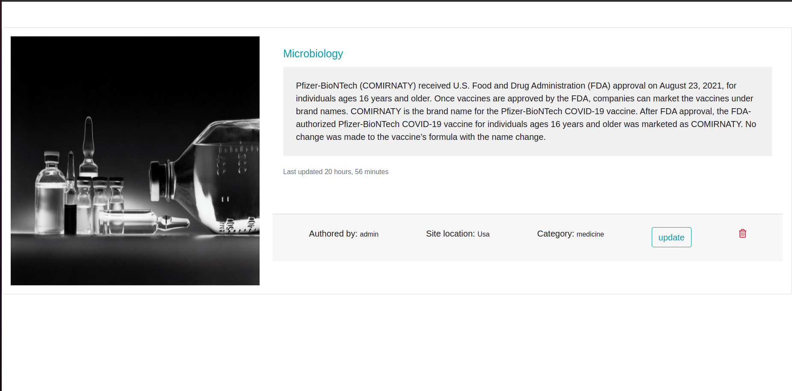

# Portfolio
##### MICHAEL OGAYE
### Aj-galleries
## Table of Content
+ [Description](#description)
+ [Installation Requirement]( Requisites)
+ [Technology Used](technology-used)
+ [Reference](#reference)
+ [Licence](#licence)
+ [Authors Info](#aut)
## Description

Aj-galleries, a web application that allows users to take snapshot photos of their life experiences and upload them and provide more information, they are able to delete update and even delete their collections

## Screenshot

## set-up
### Vitals
* A stable computer,whith proven working capacity
* Internet connectivity to keep on committing your work to the github repo
* An Heroku account to deploy the project
* Postgres database connection
### Installation Process
* The project is done in git initialized environment to enable one keep on saving his work on a remote repo
## Technology Used
* Python
* Django
* heroku
* Postgres

  
[Go Back to the top](#portfolio)
## Licence
[MIT License](./LICENSE)
Copyright (c) [2022] [Michael Ogaye]

[Go Back to the top](#portfolio)
## Authors Info
Slack Profile - Michael Ogaye

Linkedln - [Michael Ogaye](https://www.linkedin.com/in/ogaye-michael-279342212/)

Email: hogaeymic@gmail.com

[Go Back to the top](#portfolio)